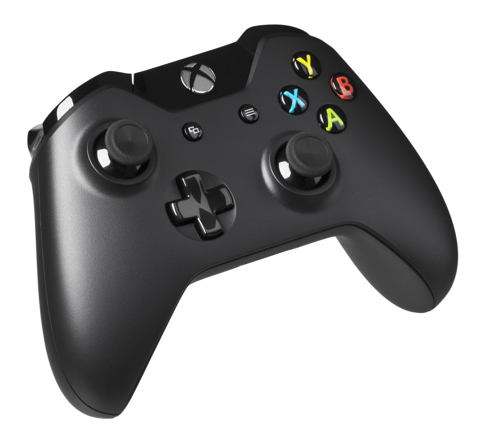

# Trabalho 2 - 2026-1: Estudo do Controle de Xbox One

## Integrantes do Grupo

| Nome                          | Matrícula |
| :---------------------------- | :-------- |
| Edilson Ribeiro               | 222024461 |
| Ruan Carvalho                 | 211043763 |
| Gustavo Feitosa Haubert       | 222024793 |
| João Vitor Santos de Oliveira | 221022337 |

---

# 1. Descrição do Produto Selecionado



_Figura 1 – Xbox One Wireless Controller, modelo 1537. Fonte: [Microsoft](https://commons.wikimedia.org/wiki/File:Microsoft-Xbox-One-Console-Set-wKinect.jpg#/media/File:Microsoft-Xbox-One-controller.jpg/2)._

## 1.1. Funções Principais, Público-Alvo e Contexto de Uso

Este dispositivo foi projetado para usuários do Xbox One, sendo o controle tendo foco em alta performance, entregando baixa latência e um feedback tátil altamente imersivo. Graças a essa alta performance, ele atende a um público-alvo amplo, que vai desde jogadores casuais até atletas profissionais de esportes. Essa versatilidade se reflete também em seu contexto de uso: além de ser peça-chave em consoles Xbox, PCs (Windows) e plataformas móveis, o dispositivo vai além do mundo dos games, podendo ser aplicado em projetos de robótica e desenvolvimento acadêmico.

## 1.2. Componentes e Sensores Utilizados

Agora sobre componentes e sensores, o controle adota uma arquitetura focada em imersão e durabilidade. O sistema tátil é composto por uma topologia de quatro motores de massa rotativa excêntrica (ERM): dois motores principais integrados ao chassi (esquerdo e direito) para vibrações globais e dinâmicas, e dois micromotores independentes posicionados nos gatilhos esquerdo (LT) e direito (RT) para respostas táteis localizadas na ponta dos dedos ([iFixit — Teardown](https://www.ifixit.com/Teardown/Xbox+One+Wireless+Controller+Teardown/122645); [Microsoft Learn — Gamepad e vibração](https://learn.microsoft.com/pt-br/windows/uwp/gaming/gamepad-and-vibration)). Já o sensoriamento de posição é heterogêneo: os gatilhos (LT/RT) utilizam sensores magnéticos de Efeito Hall (componentes U10 e U11 no PCB), uma tecnologia que elimina o contato mecânico e evita o desgaste por atrito ([iFixit — Teardown](https://www.ifixit.com/Teardown/Xbox+One+Wireless+Controller+Teardown/122645)); os joysticks analógicos duplos, por outro lado, utilizam potenciômetros convencionais — um contato condutor deslizando sobre uma trilha resistiva —, o que os torna suscetíveis ao desgaste mecânico e é a causa raiz do conhecido problema de _stick drift_ deste modelo de controle.

Para o comando digital, o projeto combina diferentes engenharias de acionamento para otimizar o tato e a vida útil do hardware. Os botões de ação (A, B, X, Y) utilizam membranas para um clique mais macio e confortável, já o direcional (D-Pad) emprega chapas metálicas para garantir respostas rápidas e aquele feedback firme e audível. Complementando o conjunto, os botões de ombro superiores utilizam micro-switches, priorizando a máxima precisão ([iFixit — Teardown](https://www.ifixit.com/Teardown/Xbox+One+Wireless+Controller+Teardown/122645)).

Por fim, a interface do sistema é gerenciada por botões de navegação dedicados. O "Botão Xbox", posicionado centralmente, atua como o guia principal para ligar o console e acessar rapidamente o painel de controle, enquanto os botões "Menu" e "View" desempenham funções contextuais, permitindo a interação com interfaces de software, gerenciamento de menus e navegação dinâmica dentro dos jogos.

## 1.3. Tecnologias de Comunicação e Controle Embarcadas

Na parte inferior abriga uma entrada de 3,5 mm (P2/P3), garantindo conectividade analógica direta para fones de ouvido e headsets ([Microsoft — Xbox Wireless Controller, product manual](https://cc.cs.1worldsync.com/inlinecontent/mediaserver/all/a4b/8b3/a4b8b3b058101aca23fec338a4e27d33/original.pdf)).

Para jogar sem fios, ele usa uma conexão exclusiva super rápida (Xbox Wireless) e, nos modelos mais novos (a partir do modelo 1708), também conta com Bluetooth ([FCC ID C3K1697](https://fcc.report/FCC-ID/C3K1697); [Windows Central — Xbox Wireless](https://www.windowscentral.com/xbox-wireless)). Para o uso cabeado, o sistema emprega uma interface Micro-USB 2.0.

Por fim, o ecossistema é sustentado por um sistema eficiente de gerenciamento de energia. O hardware consegue estabilizar a alimentação do circuito constantemente em 3,3V. Esse mecanismo assegura que o controle opere com performance máxima e sem oscilações mesmo quando as pilhas estão com carga baixa, otimizando o consumo energético global e estendendo a vida útil da carga ([iFixit — Teardown](https://www.ifixit.com/Teardown/Xbox+One+Wireless+Controller+Teardown/122645)).

---

# 2. Análise Técnica do Funcionamento

## 2.1. Principais Módulos do Sistema

Do ponto de vista funcional, o controle pode ser decomposto em cinco módulos que operam de forma integrada e cíclica, coordenados por um microcontrolador central de baixo consumo.

O **módulo de sensoriamento** é responsável por capturar as entradas analógicas e digitais do usuário, com duas tecnologias distintas de posicionamento. Os gatilhos LT/RT utilizam sensores de Efeito Hall, que traduzem a posição do ímã acoplado ao eixo em uma tensão analógica proporcional; já os joysticks duplos utilizam potenciômetros resistivos (contato deslizante), uma solução mais suscetível a desgaste mecânico. Em ambos os casos, o sinal analógico resultante é lido por um conversor analógico-digital (ADC) interno ao microcontrolador. Já os botões de ação, D-Pad, botões de ombro e os botões de navegação (Xbox, Menu, View) formam uma matriz digital que é varrida (_scan_) continuamente para detectar mudanças de estado.

O **módulo de atuação** compreende os quatro motores ERM (dois no chassi e dois nos gatilhos), acionados por _drivers_ dedicados que convertem comandos digitais (recebidos do console via protocolo sem fio) em sinais PWM (_Pulse Width Modulation_, ou Modulação por Largura de Pulso) que controlam a intensidade e a duração da vibração. Como o microcontrolador só consegue gerar em seus pinos digitais os níveis lógicos 0V ou 3,3V, o PWM simula uma tensão intermediária alternando rapidamente entre esses dois estados: a fração de tempo em que o sinal permanece "ligado" a cada ciclo (_duty cycle_) determina a tensão média entregue ao motor e, consequentemente, a intensidade da vibração percebida pelo usuário.

O **módulo de controle central** é o microcontrolador que orquestra todo o sistema: realiza a leitura periódica dos sensores (_polling_), empacota esses dados em quadros de telemetria, gerencia o acionamento dos atuadores hápticos conforme comandos recebidos, e supervisiona o estado de energia do dispositivo (incluindo a transição para modos de baixo consumo).

O **módulo de interface** é o conjunto físico de botões, gatilhos e joysticks que traduz a intenção do usuário em sinais elétricos, complementado pela porta P2/P3 de 3,5 mm para áudio analógico.

Por fim, o **módulo de conectividade** integra o rádio proprietário Xbox Wireless (e, nos modelos mais recentes, também Bluetooth Low Energy) para a comunicação sem fio com o console, PC ou dispositivo móvel, além da interface física Micro-USB 2.0 para conexão cabeada e carregamento.

## 2.2. Identificação de Tecnologias Críticas

**Protocolo sem fio proprietário (Xbox Wireless):** diferentemente de um gamepad Bluetooth convencional, o Xbox Wireless opera na mesma faixa de 2,4 GHz do Bluetooth, mas utiliza um canal dedicado com maior potência de transmissão e priorização de Quality of Service (QoS), o que reduz a latência de entrada para menos de 20 ms. Essa é a tecnologia crítica que garante a resposta "instantânea" percebida pelo jogador, sendo um dos principais motivos pelos quais o Bluetooth (introduzido apenas a partir do modelo 1708, junto ao Xbox One S) coexiste com o protocolo proprietário em vez de substituí-lo: o Bluetooth garante compatibilidade ampla com PCs e celulares, enquanto o Xbox Wireless prioriza o desempenho em jogo.

**Firmware embarcado sem sistema operacional completo:** o fabricante não documenta publicamente a arquitetura de firmware do controle, mas, dadas as restrições de custo, consumo energético e determinismo temporal típicas desse tipo de dispositivo, é razoável inferir que ele não execute um sistema operacional embarcado completo (como Linux), e sim um firmware dedicado (_bare-metal_ ou baseado em um RTOS leve) que executa um laço cíclico de leitura de sensores, empacotamento e transmissão em alta frequência de amostragem, minimizando a latência ponta a ponta entre a ação do usuário e a resposta no jogo.

**Técnicas de economia de energia:** é documentado que o sistema de gerenciamento de energia estabiliza a alimentação em 3,3V mesmo com a queda de tensão natural das pilhas ao longo da descarga. A partir disso, é plausível inferir o uso de um regulador (LDO ou _buck converter_) entre a fonte e os circuitos sensíveis (MCU, sensores Hall e rádio), embora o componente exato não seja publicamente documentado. Adicionalmente, controles sem fio tipicamente empregam modos de baixo consumo (_sleep/idle_) quando não há atividade do usuário por um determinado período, reduzindo o duty-cycle do rádio e desligando os motores hápticos quando ociosos, o que estende significativamente a autonomia das pilhas/bateria — uma prática comum no setor, ainda que não confirmada especificamente para este modelo.

---

# 3. Proposta de Reprodução com ESP32

## 3.1 Descrição conceitual

A proposta consiste na reprodução das principais funcionalidades do controle do Xbox One utilizando uma **ESP32** como unidade de processamento e o framework **ESP-IDF** para o desenvolvimento do firmware. A comunicação com o computador seria realizada por meio do perfil **Bluetooth HID (Human Interface Device)**, permitindo que o dispositivo seja reconhecido como um gamepad.

Os componentes principais seriam:

| Função        | Componente                                                     |
| ------------- | -------------------------------------------------------------- |
| Processamento | ESP32                                                          |
| Joysticks     | 2x Joystick com 2 eixos e botão                                |
| Botões        | Botões tácteis (A, B, X, Y, LB, RB, Start, Back, D-Pad e Xbox) |
| Comunicação   | Bluetooth integrado                                            |

O firmware executaria continuamente as seguintes etapas:

1. Leitura dos joysticks e botões;
2. Filtragem e calibração das entradas;
3. Geração do relatório HID;
4. Envio dos comandos via Bluetooth.

---

### Implementação com Hall Effect

Como melhoria em relação aos joysticks convencionais, propõe-se a utilização da tecnologia **Hall Effect**, eliminando o desgaste dos potenciômetros e reduzindo a ocorrência de *stick drift*.

#### Opção 1 – Joystick Hall Effect

Substituição direta dos joysticks convencionais por módulos que já utilizam sensores Hall internamente.

**Vantagens**

- Fácil implementação;
- Alta precisão;
- Maior durabilidade;
- Elimina praticamente o *stick drift*.

**Desvantagens**

- Maior custo;
- Dependência de módulos específicos.

---

#### Opção 2 – Sensores Hall discretos

Construção do joystick utilizando **Sensores de Efeito Hall Linear** ou **Sensores Hall Analógicos** disponíveis no laboratório, juntamente com pequenos ímãs presos ao eixo do joystick.

**Vantagens**

- Menor custo;
- Maior flexibilidade;
- Melhor compreensão do funcionamento da tecnologia.

**Desvantagens**

- Projeto mecânico mais complexo;
- Necessidade de calibração e posicionamento preciso dos sensores.

---
## 3.2 Diagrama conceitual

```text
                 ┌──────────────────────────┐
                 │          ESP32           │
                 │      Firmware ESP-IDF    │
                 └───────────┬──────────────┘
                             │
              ┌──────────────┴─┬─────────────────┐
              ▼                ▼                 ▼
         Joystick Esq.       Joystick Dir.      Botões/D-Pad
            (ADC)                (ADC)             (GPIO)

                             │
                             ▼
                  Processamento dos comandos
                             │
                             ▼
                    Bluetooth HID (BLE)
                             │
                             ▼
                         Computador
```

---

## 3.3 Limitações e desafios

Os principais desafios da implementação são:

- Configuração do perfil Bluetooth HID na ESP32;
- Calibração das leituras analógicas dos joysticks;
- Redução de ruídos nas entradas ADC;
- Projeto mecânico mais complexo ao utilizar sensores Hall discretos.

Além disso, algumas funcionalidades do controle original não seriam implementadas, como vibração, gatilhos com resposta tátil e conector para headset.

---

# 4. Pesquisa Bibliográfica e Tecnológica

## 4.1. Artigos sobre Tecnologias que Viabilizam o Produto

### Artigo 1 - Feedback Tátil com Gamepads Comerciais

**Título:** A Versatile Tool for Haptic Feedback Design Towards Enhancing User Experience in Virtual Reality Applications

**Autores:** Vasilije Bursać e Dragan Ivetić

**Periódico:** _Applied Sciences_ (MDPI) - indexado na Scopus e Web of Science

**Ano:** 2025

**Link:** [https://doi.org/10.3390/app15105419](https://doi.org/10.3390/app15105419)

**Resumo:** O trabalho investiga a integração de feedback tátil (_haptic feedback_) de alta fidelidade em ambientes virtuais imersivos utilizando gamepads comerciais amplamente disponíveis no mercado (como o controle de Xbox), que representam uma alternativa de baixo custo em relação a luvas e coletes táteis especializados. Os autores propõem um _framework_ e uma ferramenta visual de edição baseada em curvas de animação paramétricas integradas ao Unity. Essa arquitetura de software permite criar bibliotecas de estímulos táteis orientadas a objetos, simulando de forma precisa a amplitude, a frequência, o ritmo e a atenuação temporal das vibrações com base no tipo de interação que o avatar executa no ambiente virtual.

**Relação com Sistemas Embarcados:** Este artigo aborda diretamente o desafio de controle de atuadores físicos (transdutores táteis). Na engenharia de embarcados, a conversão de curvas de intensidade lógica (de 0.0 a 1.0) em vibração física esbarra nas limitações mecânicas dos motores de Massa Rotativa Excêntrica (ERM) comumente usados no controle do Xbox.

---

### Artigo 2 - Atuadores Hápticos Vestíveis com Comunicação Sem Fio de Baixa Latência

**Título:** Haplets: Finger-Worn Wireless and Low-Encumbrance Vibrotactile Haptic Feedback for Virtual and Augmented Reality

**Autores:** Pornthep Preechayasomboon e Eric Rombokas

**Periódico:** _Frontiers in Virtual Reality_ (Frontiers) - indexado na Scopus e Web of Science

**Ano:** 2021

**Link:** [https://doi.org/10.3389/frvir.2021.738613](https://doi.org/10.3389/frvir.2021.738613)

**Resumo:** O artigo apresenta o Haplets, um dispositivo háptico vestível e sem fio, projetado para ser usado nas unhas dos dedos, capaz de renderizar feedback vibrotátil em aplicações de realidade virtual e aumentada. Do ponto de vista de engenharia embarcada, o trabalho detalha o projeto de hardware de cada unidade: um atuador ressonante linear (LRA) acionado por um _driver_ de motor dedicado (DRV8838), um SoC sem fio (nRF52832) e uma bateria de célula tipo moeda. Os autores desenvolvem e caracterizam um protocolo de rádio proprietário de baixíssima latência (Enhanced ShockBurst, da Nordic Semiconductor), atingindo latência mediana de 1,50 ms, além de um procedimento de caracterização e compensação de amplitude do atuador em função da frequência e do local de fixação no corpo.

**Relação com Sistemas Embarcados:** Diferente do Artigo 1 (focado em _software_ para curvas de animação háptica), este artigo aborda o problema pelo lado do _hardware_ e do firmware: como projetar o circuito de acionamento de um motor vibratório (análogo aos ERM do controle Xbox) e como garantir baixa latência na comunicação sem fio entre o microcontrolador e o atuador. Essa metodologia de caracterização de atuador e de projeto de protocolo de rádio de baixa latência é diretamente aplicável ao replicar o subsistema háptico do controle usando um ESP32 e um motor de vibração controlado via PWM.

---

### Artigo 3 - Comunicação Sem Fio de Baixo Consumo (Bluetooth Low Energy)

**Título:** Low-Power Wireless for the Internet of Things: Standards and Applications

**Autores:** Ali Nikoukar, Saleem Raza, Angelina Poole, Mesut Güneş e Behnam Dezfouli

**Periódico:** IEEE Access (indexado na Scopus, Web of Science e Journal Citation Reports)

**Ano:** 2018

**Link:** [https://doi.org/10.1109/ACCESS.2018.2879189](https://doi.org/10.1109/ACCESS.2018.2879189)

**Resumo:** O artigo faz um levantamento abrangente das principais tecnologias de comunicação sem fio de baixo consumo usadas em dispositivos IoT, com foco nas camadas Física (PHY) e de Controle de Acesso ao Meio (MAC). Entre as tecnologias analisadas está o Bluetooth Low Energy (BLE), padrão introduzido em 2011 pelo Bluetooth SIG e incorporado aos modelos mais recentes do Xbox One Controller (a partir do modelo 1708) para reduzir o consumo energético em relação ao Bluetooth clássico (BR/EDR). Os autores detalham como o BLE simplifica a camada de enlace ao suportar apenas um tipo de pacote (contra os 17 tipos do BR/EDR), reduz o número de canais de conexão para apenas 3 canais de anúncio (advertisement channels) — o que acelera e economiza energia no estabelecimento da conexão — e utiliza uma máquina de estados de cinco fases (Standby, Advertising, Scanning, Initiating e Connection) para gerenciar quando o rádio deve transmitir, escutar ou entrar em modo de economia de energia. O artigo também compara o consumo de corrente de diferentes SoCs comerciais compatíveis com BLE, mostrando correntes de sono (sleep current) na faixa de 0,9 a 1,9 µA, o que evidencia por que esse protocolo é adequado para periféricos alimentados por pilhas AA ou baterias pequenas, como é o caso do controle de Xbox.

**Relação com Sistemas Embarcados:** Este artigo é diretamente relevante para explicar a tecnologia de conectividade sem fio do Xbox One Controller na seção de "Tecnologias Críticas" do relatório. Ele fundamenta, do ponto de vista de engenharia de sistemas embarcados, a escolha do BLE em detrimento do rádio proprietário "Xbox Wireless" em cenários onde o baixo consumo energético é prioridade sobre a latência mínima — um trade-off que pode ser reproduzido na proposta de reprodução com ESP32, já que o ESP32 possui suporte nativo a BLE. O artigo também oferece dados concretos (corrente de transmissão, corrente de pico em recepção, corrente de sono) que podem ser usados para estimar a autonomia de bateria de um protótipo baseado em ESP32 que replique a funcionalidade de conectividade sem fio do controle original.

---

### Artigo 4 - Gestão de Energia e Protocolos de Baixo Consumo em Dispositivos Embarcados Autônomos

**Título:** Efficient Integration of Ultra-low Power Techniques and Energy Harvesting in Self-Sufficient Devices: A Comprehensive Overview of Current Progress and Future Directions

**Autores:** Rocco Citroni, Fabio Mangini e Fabrizio Frezza

**Periódico:** Sensors (MDPI) - indexado na Scopus e Web of Science

**Ano:** 2024

**Link:** [https://doi.org/10.3390/s24144471](https://doi.org/10.3390/s24144471)

**Resumo:** Este artigo de revisão apresenta um panorama abrangente das técnicas de projeto de ultra-baixo consumo (ULPDT) e das estratégias de gerenciamento de energia usadas em nós sensores e dispositivos embarcados autônomos. Os autores detalham os três estados operacionais típicos de um dispositivo alimentado por bateria — sleep, wake-up e active — e demonstram, com base em dados de nós sensores comerciais, que o consumo durante o modo de comunicação sem fio (recepção/transmissão de rádio) supera em ordens de grandeza o consumo em modo de repouso, o que justifica tecnicamente por que os fabricantes priorizam ciclos de trabalho curtos (duty cycling) nesse subsistema. O artigo também descreve, em nível de circuito, as fontes de dissipação de potência em CMOS (dinâmica, curto-circuito e estática/leakage) e cataloga técnicas de mitigação como clock gating, power gating, escalonamento de tensão e voltage/frequency scaling. Na seção de protocolos, os autores comparam formalmente o Bluetooth Clássico (BR/EDR) com o Bluetooth Low Energy, mostrando que a corrente de pico do BLE (<15 mA) é metade da do Bluetooth Clássico (<30 mA), com igual alcance mas latência drasticamente menor — dado tecnicamente relevante para justificar a migração do Xbox One Controller do rádio proprietário 2,4 GHz para o BLE nos modelos mais recentes. Por fim, o trabalho compara opções de armazenamento de energia (pilhas primárias, baterias recarregáveis, supercapacitores), incluindo uma tabela detalhada de parâmetros elétricos de baterias comerciais como NiMH e Li-Ion — tecnologias equivalentes às usadas nos kits de recarga opcionais do Xbox.

**Relação com Sistemas Embarcados:** O artigo fornece o embasamento teórico de engenharia de sistemas embarcados para explicar duas decisões de projeto centrais do Xbox One Controller: (1) a escolha por pilhas AA substituíveis em vez de bateria interna, o que se conecta diretamente à discussão do artigo sobre non-rechargeable vs. rechargeable batteries e às vantagens de custo/manutenção das pilhas primárias para dispositivos de baixo consumo médio (<50 µW); e (2) a arquitetura de gerenciamento de energia baseada em estados sleep/wake-up/active, que é exatamente o modelo que precisa ser replicado no firmware do ESP32 na proposta de reprodução do trabalho, usando os modos de baixo consumo nativos do chip (light sleep, deep sleep) para maximizar a autonomia de bateria do protótipo.

---

## 4.2. Artigos sobre Aplicação / Uso do Produto

### Artigo 1 - Teleoperação Veicular com Gamepad Xbox

**Título:** Enhanced Teleoperation for Manual Remote Driving: Extending ADAS Remote Control Towards Full Vehicle Operation

**Autores:** İsa Karaböcek, Ege Özdemir e Batıkan Kavak

**Periódico:** _Engineering Proceedings_ (MDPI) - Apresentado no ECSA-12

**Ano:** 2025

**Link:** [https://www.mdpi.com/2673-4591/118/1/40](https://www.mdpi.com/2673-4591/118/1/40)

**Resumo:** Este estudo apresenta o desenvolvimento de uma arquitetura modular de teleoperação de veículos em tempo real, integrando o controle humano direto aos sistemas embarcados de assistência ao motorista (ADAS). Os autores implementaram uma interface de controle baseada em um gamepad sem fio padrão de Xbox, conectado via Bluetooth a uma estação cliente. Os dados de entrada analógicos dos gatilhos (aceleração/frenagem) e direcionais (esterço da direção) são capturados via biblioteca SDL, mapeados instantaneamente em pacotes de comunicação assíncronos e transmitidos por meio de protocolo UDP para o computador embarcado do veículo físico que executa uma pilha de software baseada em ROS (_Robot Operating System_).

**Relação com Sistemas Embarcados:** Este artigo é um caso de estudo sobre como interfaces de consumo podem ser aplicadas em malhas de controle embarcado de missão crítica e tempo real. Ele detalha os requisitos de projeto de sistemas _hardware-in-the-loop_, abordando a mitigação de latência fim-a-fim na comunicação sem fio (por meio da migração de Wi-Fi 4 para Wi-Fi 5 nas antenas do veículo de teste).

---

### Artigo 2 – Desenvolvimento de Joysticks com Sensores Hall Effect

**Título:** _Joystick and Lever Design With Hall-Effect Sensors (Rev. A)_

**Autores:** Patrick Simmons e Scott Bryson

**Publicação:** Texas Instruments – Application Report (SLYU064A)

**Ano:** 2023 (Revisão A)

**Link:** https://www.ti.com/lit/an/slyu064a/slyu064a.pdf

**Resumo:**  
O documento apresenta diretrizes para o desenvolvimento de joysticks utilizando sensores de efeito Hall, abordando o funcionamento da tecnologia, o posicionamento de ímãs e sensores, técnicas de calibração, processamento dos sinais e análise das principais fontes de erro. Também são apresentados exemplos de implementação para aplicações em controles de jogos, realidade virtual e sistemas automotivos, destacando as vantagens da tecnologia Hall Effect em relação aos potenciômetros convencionais.

**Relação com Sistemas Embarcados:**  
O documento serve como base para a implementação de joysticks utilizando sensores Hall em sistemas embarcados. Os conceitos apresentados podem ser aplicados na leitura dos sensores pela ESP32 por meio dos conversores ADC, permitindo o desenvolvimento de um controle mais preciso e durável. Além disso, as técnicas de calibração e tratamento dos sinais contribuem para reduzir erros de medição e eliminar problemas como o _stick drift_, tornando a solução mais confiável para aplicações embarcadas.

---

### Artigo 3 – Desenvolvimento de Dispositivos Bluetooth com ESP32

**Título:** _Practical Challenges and Pitfalls of Bluetooth Mesh Data Collection Experiments With ESP32 Microcontrollers_

**Autores:** Marcelo Paulon J. V., Bruno José Olivieri de Souza, Thiago de Souza Lamenza e Markus Endler

**Periódico:** arXiv (pré-publicação científica)

**Ano:** 2022

**Link:** https://arxiv.org/abs/2211.10696

**Resumo:**  
O artigo apresenta o desenvolvimento e a avaliação de uma infraestrutura de comunicação utilizando **Bluetooth Mesh** com microcontroladores ESP32. Os autores implementam uma rede composta por diversos dispositivos embarcados para coleta de dados, analisando aspectos como confiabilidade da comunicação, perda de pacotes, latência, consumo de energia e limitações práticas encontradas durante a implementação. Além dos experimentos em ambiente real, o trabalho compara os resultados obtidos com simulações, identificando desafios e propondo boas práticas para o desenvolvimento de dispositivos Bluetooth baseados na ESP32.

**Relação com Sistemas Embarcados:**  
O artigo demonstra a utilização da ESP32 como plataforma para o desenvolvimento de dispositivos embarcados com comunicação Bluetooth, explorando a integração entre hardware, firmware e protocolos de comunicação. Embora o foco seja Bluetooth Mesh, os conceitos de configuração da pilha Bluetooth, gerenciamento da comunicação sem fio, processamento local e otimização do consumo de energia são diretamente aplicáveis ao desenvolvimento de um controle Bluetooth baseado em ESP32. Essas contribuições servem como referência para a implementação da comunicação sem fio do controle utilizando o framework ESP-IDF.

---

### Artigo 4 - Teleoperação de Robô Móvel via Realidade Virtual com Gamepad Xbox

**Título:** Virtual Reality-Based Interface for Advanced Assisted Mobile Robot Teleoperation

**Autores:** J. Ernesto Solanes, Adolfo Muñoz, Luis Gracia e Josep Tornero

**Periódico:** _Applied Sciences_ (MDPI) - indexado na Scopus e Web of Science

**Ano:** 2022

**Link:** [https://doi.org/10.3390/app12126071](https://doi.org/10.3390/app12126071)

**Resumo:** Os autores propõem uma interface de realidade virtual para a teleoperação assistida de robôs móveis, aplicada ao robô Turtlebot3 Burger (equipado com um controlador embarcado ARM Cortex-M7 e um Raspberry Pi como controlador de alto nível). O usuário, utilizando um headset Oculus Quest 2, arrasta uma referência de posição no ambiente virtual por meio de um controle sem fio Xbox conectado via Bluetooth; o robô, por sua vez, combina esse comando com um controlador reativo baseado em campos potenciais (via sensor LiDAR) para desviar de obstáculos automaticamente. Testes de usabilidade com 11 participantes de perfis variados (a maioria sem experiência prévia com VR ou gamepads) indicaram alta usabilidade (90,91/100 na escala SUS) e forte sensação de presença, validando o gamepad como interface preferível aos controles dedicados de VR para tarefas de teleoperação prolongadas.

**Relação com Sistemas Embarcados:** Assim como o Artigo 1 desta seção, trata-se de uma aplicação de teleoperação com o controle Xbox, porém em outro domínio (robótica móvel indoor via headset de VR, em vez do controle direto de um veículo real via ADAS). O artigo evidencia a robustez e a ergonomia do protocolo Bluetooth do controle como interface de alto nível para comandar um sistema embarcado reativo (o laço de navegação por campo potencial roda localmente no Raspberry Pi/OpenCR do robô), reforçando a viabilidade de usar um gamepad Xbox como fonte de referência de movimento em projetos de robótica baseados em ESP32.

---

# 5. Comparativo com Produtos Similares

**Produtos de mercado relacionados ao Xbox One Controller:**

1. Xbox 360 Controller (Microsoft, 2005) — geração anterior
2. Xbox Series X|S Controller (Microsoft, 2020) — geração seguinte
3. Sony DualShock 4 (PS4, 2013) — concorrente direto/mesma geração
4. Sony DualSense (PS5, 2020) — concorrente de geração seguinte
5. Nintendo Switch Pro Controller (Nintendo, 2017) — concorrente de geração intermediária

**Tabela comparativa:**

| Produto                                      | Ano / Geração     | Fabricante | Conectividade                                            | Sensores de movimento                           | Touchpad                             | Energia                                                           | Particularidades                                                                                                            |
| -------------------------------------------- | ----------------- | ---------- | -------------------------------------------------------- | ----------------------------------------------- | ------------------------------------ | ----------------------------------------------------------------- | --------------------------------------------------------------------------------------------------------------------------- |
| **Xbox One Controller** _(objeto de estudo)_ | 2013 (8ª geração) | Microsoft  | Xbox Wireless 2,4 GHz; Bluetooth a partir do modelo 1708 | Não possui                                      | Não                                  | 2x pilhas AA ou bateria recarregável opcional (Play & Charge Kit) | Gatilhos analógicos com motores de vibração independentes; layout herdado do Xbox 360 com refinamentos ergonômicos          |
| Xbox 360 Controller                          | 2005 (7ª geração) | Microsoft  | Rádio proprietário 2,4 GHz (sem Bluetooth nativo)        | Não possui                                      | Não                                  | 2x pilhas AA ou battery pack NiMH (até ~40 h com kit aprimorado)  | Antecessor direto do Xbox One Controller; base do layout de botões mantido até hoje                                         |
| Xbox Series X\|S Controller                  | 2020 (9ª geração) | Microsoft  | Xbox Wireless + Bluetooth Low Energy                     | Não possui                                      | Não                                  | 2x pilhas AA (≈30–40 h)                                           | Conector USB-C, suporte a Bluetooth Low Energy e Dynamic Latency Input (reduz latência sincronizando com a taxa de quadros) |
| Sony DualShock 4 (PS4)                       | 2013 (8ª geração) | Sony       | Bluetooth 2.1+EDR                                        | Sim — giroscópio e acelerômetro de 3 eixos cada | Sim — capacitivo, 2 pontos, clicável | Bateria interna de íon-lítio, 3,7 V / 1000 mAh                    | Barra de luz com três LEDs e alto-falante mono integrado; contemporâneo direto do Xbox One Controller                       |
| Sony DualSense (PS5)                         | 2020 (9ª geração) | Sony       | Bluetooth                                                | Sim — giroscópio e acelerômetro                 | Sim                                  | Bateria interna de íon-lítio, 3,65 V / 1560 mAh                   | Gatilhos adaptativos com motores rotativos DC, feedback háptico por atuadores de bobina e microfone integrado               |
| Nintendo Switch Pro Controller               | 2017 (8ª geração) | Nintendo   | Bluetooth 3.0                                            | Sim — acelerômetro e giroscópio                 | Não                                  | Bateria interna de íon-lítio, ≈1300 mAh (≈40 h de uso)            | Leitor NFC para Amiibo e tecnologia HD Rumble para feedback vibratório mais granular                                        |

---

## Referências Bibliográficas

ESPRESSIF SYSTEMS. **LED Control (LEDC) - ESP32**: ESP-IDF Programming Guide. [S. l.]: Espressif, 2026. Disponível em: [https://docs.espressif.com/projects/esp-idf/en/stable/esp32/api-reference/peripherals/ledc.html](https://docs.espressif.com/projects/esp-idf/en/stable/esp32/api-reference/peripherals/ledc.html). Acesso em: 30 jun. 2026.

FEDERAL COMMUNICATIONS COMMISSION. **FCC ID C3K1697**: Microsoft Corporation Xbox One Wireless Controller. Washington, DC: FCC, 2015. Disponível em: [https://fcc.report/FCC-ID/C3K1697](https://fcc.report/FCC-ID/C3K1697). Acesso em: 30 jun. 2026.

IFIXIT. **Xbox One Wireless Controller 1697**. [S. l.]: iFixit, 2026. Disponível em: [https://www.ifixit.com/Device/Xbox_One_Wireless_Controller_1697](https://www.ifixit.com/Device/Xbox_One_Wireless_Controller_1697). Acesso em: 30 jun. 2026.

IFIXIT. **Xbox One Wireless Controller Teardown**. [S. l.]: iFixit, 2026. Disponível em: [https://www.ifixit.com/Teardown/Xbox+One+Wireless+Controller+Teardown/122645](https://www.ifixit.com/Teardown/Xbox+One+Wireless+Controller+Teardown/122645). Acesso em: 30 jun. 2026.

MICROSOFT. **Gamepad e vibração**. [S. l.]: Microsoft Learn, 2024. Disponível em: [https://learn.microsoft.com/pt-br/windows/uwp/gaming/gamepad-and-vibration](https://learn.microsoft.com/pt-br/windows/uwp/gaming/gamepad-and-vibration). Acesso em: 30 jun. 2026.

MICROSOFT. **Xbox Wireless Controller**: product manual. [S. l.]: 1WorldSync. Disponível em: [https://cc.cs.1worldsync.com/inlinecontent/mediaserver/all/a4b/8b3/a4b8b3b058101aca23fec338a4e27d33/original.pdf](https://cc.cs.1worldsync.com/inlinecontent/mediaserver/all/a4b/8b3/a4b8b3b058101aca23fec338a4e27d33/original.pdf). Acesso em: 30 jun. 2026.

WIKIPEDIA. **Xbox Wireless Controller**. [S. l.], 2026. Disponível em: [https://en.wikipedia.org/wiki/Xbox_Wireless_Controller](https://en.wikipedia.org/wiki/Xbox_Wireless_Controller). Acesso em: 30 jun. 2026.

WINDOWS CENTRAL. **Xbox Wireless: Everything you need to know**. [S. l.]: Windows Central, 2026. Disponível em: [https://www.windowscentral.com/xbox-wireless](https://www.windowscentral.com/xbox-wireless). Acesso em: 30 jun. 2026.

MICROSOFT. **Xbox 360 Wireless Controller for Windows — Technical Data Sheet**. Redmond: Microsoft Corporation. Disponível em: [ https://download.microsoft.com/download/7/C/A/7CA6D7FD-9758-4DA8-BD27-4FDAB0C18E1F/TDS_XBox360WirelessControllerforWindows.pdf](https://download.microsoft.com/download/7/C/A/7CA6D7FD-9758-4DA8-BD27-4FDAB0C18E1F/TDS_XBox360WirelessControllerforWindows.pdf). Acesso em: 30 jun. 2026.

SONY INTERACTIVE ENTERTAINMENT. **PS4 Tech Specs**. San Mateo: Sony Interactive Entertainment LLC. Disponível em: [https://www.playstation.com/en-us/ps4/tech-specs/](https://www.playstation.com/en-us/ps4/tech-specs/). Acesso em: 30 jun. 2026.

NINTENDO. **Pro Controller — Hardware Accessories**. Redmond: Nintendo of America Inc. Disponível em: [ https://www.nintendo.com/my/hardware/switch/accessories/procon.html](https://www.nintendo.com/my/hardware/switch/accessories/procon.html). Acesso em: 30 jun. 2026.

TESCHLER, Lee. **Teardown: Playstation 5 DualSense controller**. Microcontroller Tips, WTWH Media LLC, 16 abr. 2021. Disponível em: [https://www.microcontrollertips.com/tear-down-playstation-5-dualsense-controller-faq/](https://www.microcontrollertips.com/tear-down-playstation-5-dualsense-controller-faq/). Acesso em: 30 jun. 2026.

PSU.COM. **DualSense Wireless Controller Specifications – Guide**. PlayStation Universe. Disponível em: [https://www.psu.com/news/dualsense-wireless-controller-specifications-guide/](https://www.psu.com/news/dualsense-wireless-controller-specifications-guide/). Acesso em: 30 jun. 2026.
